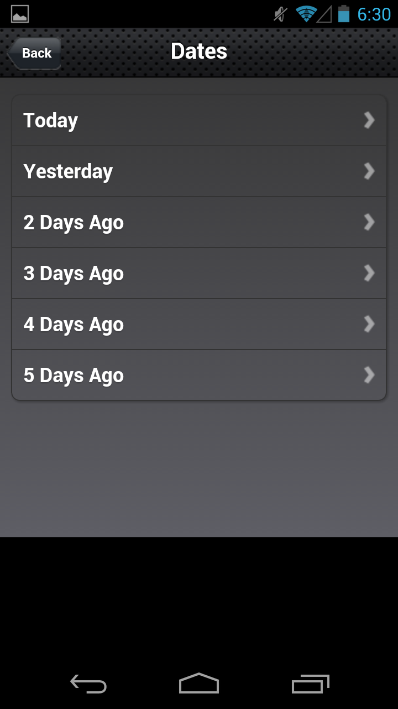
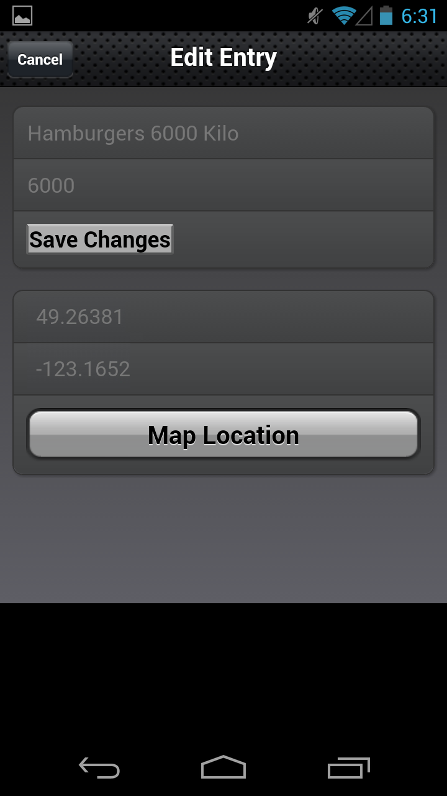
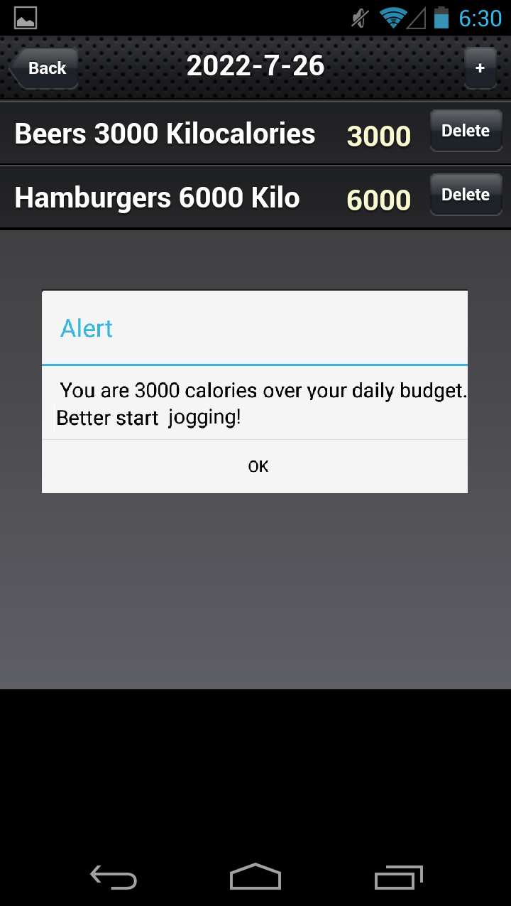
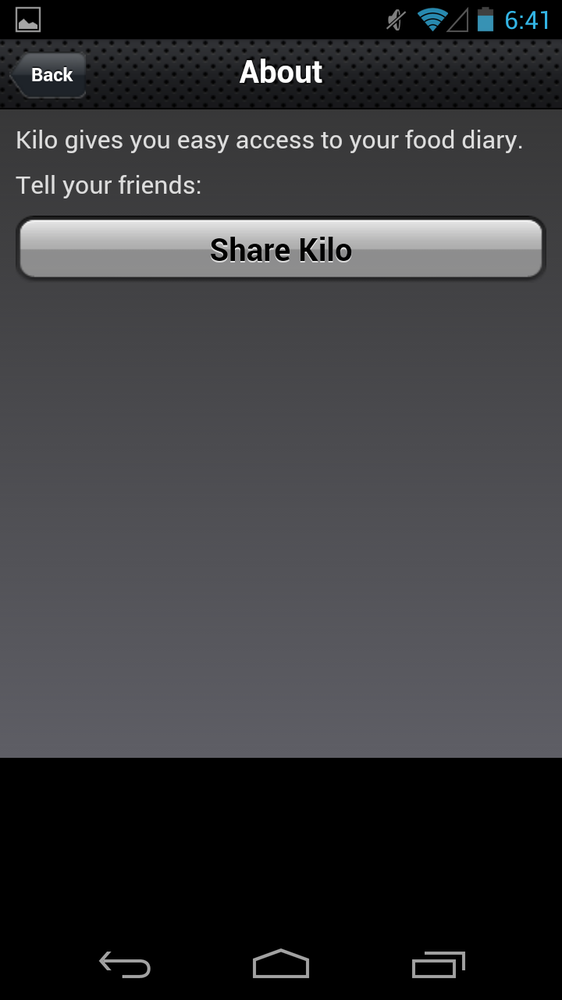

# Kilo - Calorie-counter App (Demo)

Cross platform mobile app built with HTML, CSS, JavaScript, and compiled with PhoneGap (2010). 
Based on <a href="https://www.amazon.ca/Building-iPhone-Apps-HTML-JavaScript/dp/0596805780" target="_blank">"Building iPhone Apps with HTML, CSS, and JavaScript"</a> 
 by <a href="https://www.youtube.com/watch?v=LcES5nIbMkk" target="_blank">Jonathan Stark</a>

Uses: Client-side data storage, Geolocation, etc.

 

Notes:
- Some features may no longer work on modern Android devices
- The apk file is located in this repo: \kiloproject\Kilo\bin\Kilo.apk
